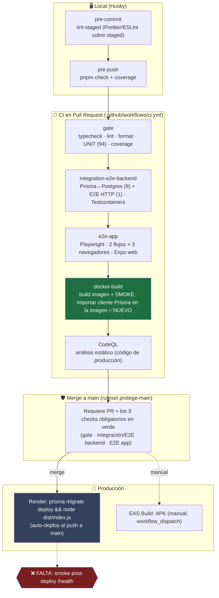

# Análisis de pruebas y CI/CD — por qué se coló el crash y cómo cerrar el hueco

> Escrito a raíz del incidente v1.9.0/v1.9.1: el backend **compilaba** pero **no arrancaba** en
> Render (`ERR_MODULE_NOT_FOUND` en el cliente Prisma 7). Complementa
> [estrategia-pruebas.md](estrategia-pruebas.md) (la pirámide y cómo correr cada nivel) y
> [flujo-cicd.md](flujo-cicd.md) (el flujo de CI/CD, sus fases, tests y reglas). Fecha: 2026-07-03.
>
> **Nota:** este documento se conserva como **histórico de un incidente puntual** (el crash
> v1.9.0/v1.9.1). La referencia general y viva del pipeline es [flujo-cicd.md](flujo-cicd.md).

## 1. Por qué NO se detectó en las pruebas

El bug: el generador de Prisma 7 emitió imports con extensión `.ts`; `tsc` compila pero **no reescribe
el especificador**, así que `dist/generated/prisma/client.js` importaba `./enums.ts` (inexistente en
runtime). Solo falla al ejecutar **`node dist/index.js`** con el resolvedor **ESM de Node puro**.

**Causa raíz del hueco de test: ningún nivel ejecutaba el ARTEFACTO COMPILADO como lo hace
producción.** Todos corren sobre el **`.ts` fuente** con un resolvedor tolerante:

| Nivel                | Corre con      | Sobre                    | Resuelve `.js`→`.ts` | ¿Ejecuta `dist/`?                   |
| -------------------- | -------------- | ------------------------ | -------------------- | ----------------------------------- |
| Unit (backend/app)   | Vitest         | `src/**`                 | Sí (esbuild/vite)    | ❌                                  |
| Integración (Prisma) | Vitest         | `src/**` + Postgres real | Sí                   | ❌                                  |
| E2E backend (HTTP)   | Vitest         | `src/**` + Postgres real | Sí                   | ❌                                  |
| E2E app (Playwright) | Playwright     | **export web** de Metro  | Sí (bundler)         | ❌ (es el app, no el backend Node)  |
| `docker-build` (CI)  | `docker build` | Dockerfile               | —                    | ❌ **solo compilaba, no arrancaba** |
| **Render (deploy)**  | **`node` ESM** | **`dist/`**              | **NO**               | ✅ **único sitio → ahí petó**       |

En resumen: Vitest, esbuild/vite y Metro **mapean `.js`↔`.ts`** y transpilan al vuelo, enmascarando
un import roto que **solo** el Node ESM de producción rechaza. Y el `docker-build` daba una **falsa
sensación de seguridad**: verificaba que la imagen _se construye_, no que _arranca_.

## 2. Diagrama del flujo y qué se prueba en cada etapa

En `develop` **E2E/integración se SALTAN** (solo corren en `main`/PR-a-main); el gate + docker-build
sí corren en cada push a `develop`.

## 3. Revisión etapa por etapa (qué garantiza / qué NO)

| Etapa                     | Garantiza                                                              | NO garantiza                                           |
| ------------------------- | ---------------------------------------------------------------------- | ------------------------------------------------------ |
| pre-commit                | Formato/lint de lo staged                                              | Nada de comportamiento                                 |
| pre-push                  | Gate + coverage en local antes de subir                                | Integración/E2E/Docker (no corren)                     |
| gate (CI)                 | Tipos, lint, formato, lógica unitaria, umbrales de cobertura           | Nada que necesite DB, red o el **artefacto compilado** |
| integración+E2E backend   | SQL real (migraciones, cascadas, índices) + contrato HTTP              | Que **`dist/` arranque** (corre sobre `src`)           |
| E2E app                   | Flujo onboarding→cuento→actividades en web                             | Nativo real (Maestro, diferido); backend Node          |
| docker-build **(+smoke)** | La imagen **construye** y **el cliente Prisma resuelve en runtime** ✅ | El arranque completo con DB (migrate+listen) — parcial |
| CodeQL                    | Vulnerabilidades de código de producción                               | Deps (eso es Dependabot)                               |
| ruleset main              | No se mergea a prod sin PR + CI verde                                  | Salud **post-deploy**                                  |
| Render                    | — (auto-deploy)                                                        | **Nadie verifica `/health` tras desplegar**            |

**El eslabón que falló** era el salto `docker-build (solo build)` → `Render (arranca dist)` sin nada en
medio que ejecutara el artefacto. Ya se añadió el **smoke de importación del cliente** en `docker-build`.

## 4. Qué falta crear (gaps, por prioridad)

1. **Smoke de arranque del contenedor en CI** (extensión del actual): levantar la imagen contra un
   Postgres efímero, correr `migrate deploy && node dist/index.js` y hacer `GET /health` → 200. Cubre
   **exactamente** lo que hace Render (no solo importar el cliente). _Coste: medio; valor: máximo._
2. **Smoke post-deploy en Render** (`/health` tras el deploy, con reintento por el cold-start). Cierra
   el único punto sin verificación del pipeline. _Coste: bajo._
3. **E2E nativo (Maestro)** — hoy esqueleto (`e2e-native.yml`); Android ya validado en local. Es la
   única cobertura del binario nativo real (donde vivían los crashes de reanimated). _Coste: alto (runner)._
4. **Test del lector con el mock determinista** que asiente el paso portada→texto (ya cubierto por E2E
   web tras el fix US-83; mantener).

## 5. Redundancias detectadas

- **E2E app ×3 navegadores:** los 2 flujos corren en `chromium`, `mobile-chrome` **y** `mobile-safari`.
  `chromium` y `mobile-chrome` comparten **motor** (Chromium) — solo cambian viewport. Como los specs
  asertan **lógica/accesibilidad** (no layout responsive), `mobile-chrome` es casi redundante: aporta
  ~1/3 del tiempo (la suite tarda ~4 min ×3). **Sugerencia:** dejar `chromium` (baseline) +
  `mobile-safari` (motor WebKit = iOS, diversidad real) y quitar `mobile-chrome`, o moverlo a un job
  nocturno. Ahorra ~1/3 del wall-clock del E2E sin perder cobertura de motor.
- **Sin redundancia real** entre unit e integración: los repos se prueban con dobles in-memory (unit,
  rápido) y con Prisma real (integración) — son capas distintas del DoD, no duplicación.

## 6. Recomendación

El pipeline es sólido para **lógica** (94 unit + 9 integración + 1 e2e backend + E2E web) y **seguridad**
(CodeQL, Dependabot endurecido, rulesets). El hueco era **el artefacto de despliegue**: se cerró
parcialmente con el smoke de `docker-build`; falta el **smoke de arranque completo** (#1) y el
**post-deploy** (#2) para tener confianza de "si el CI está verde, Render arranca". Con esos dos, el
incidente de v1.9.x no habría llegado a producción.
