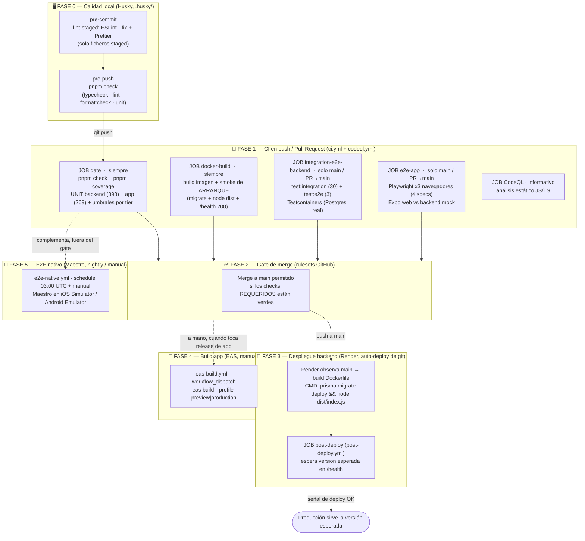

# Flujo de CI/CD — fases, pasos, tests y condiciones de aceptación

> **Documento técnico de referencia del pipeline de CI/CD de magyblob.** Describe, de principio a
> fin, qué se ejecuta en cada fase (local → CI → despliegue), **qué tests corre cada paso** (la lista
> completa) y bajo qué **condiciones de aceptación** avanza o falla el pipeline.
>
> Complementa —no sustituye— a [estrategia-pruebas.md](estrategia-pruebas.md) (la pirámide de pruebas
> y cómo correr cada nivel). Los workflows viven en [`.github/workflows/`](../.github/workflows/) y las
> reglas de rama en la configuración de GitHub (§4).

> [!IMPORTANT]
> **Este documento se actualiza en el MISMO cambio que toque el pipeline o los tests.** Siempre que
> se **añada, elimine o modifique**: (a) un workflow de `.github/workflows/`, (b) un script de test
> del pipeline (`package.json`), (c) un fichero de test listado aquí, o (d) una condición de
> aceptación (umbral de cobertura, ruleset, gate), **hay que reflejarlo aquí en el mismo commit/PR**.
> Los recuentos de tests de las tablas son orientativos (fecha de la foto abajo) y deben revisarse al
> tocar la suite. Si un número deja de cuadrar, es señal de que este doc quedó desfasado.
>
> **Última foto de recuentos:** 2026-07-03.

---

## 1. Diagrama general del flujo

Cada bloque es una **fase**; dentro, los **pasos** con los tests que ejecutan. Las flechas marcan la
condición que hay que superar para avanzar.

**Lectura rápida de qué corre según el disparador:**

| Disparador                 | gate | docker-build | integration-e2e-backend | e2e-app | CodeQL | post-deploy |
| -------------------------- | :--: | :----------: | :---------------------: | :-----: | :----: | :---------: |
| Push a `develop`           |  ✅  |      ✅      |           ❌            |   ❌    |   ✅   |     ❌      |
| PR → `develop`             |  ✅  |      ✅      |           ❌            |   ❌    |   ✅   |     ❌      |
| PR → `main`                |  ✅  |      ✅      |           ✅            |   ✅    |   ✅   |     ❌      |
| Push a `main` (post-merge) |  ✅  |      ✅      |           ✅            |   ✅    |   ✅   |     ✅      |

> La integración y los E2E se **omiten en `develop`** a propósito (ahorran minutos y evitan
> flakiness; ni el build ni el merge a `develop` dependen de ellos). En `main` son obligatorios y
> protegen producción. Condición exacta en el workflow: `github.ref_name != 'develop' &&
github.base_ref != 'develop'`.

---

## 2. Fase 0 — Calidad local (Husky)

Hooks Git versionados en [`.husky/`](../.husky/); se instalan solos tras `pnpm install` (script
`prepare`). Regla: **rápido en commit, completo en push**.

### Paso 0.1 — `pre-commit`

- **Qué ejecuta:** `lint-staged` sobre los ficheros _staged_ (config en el `package.json` raíz):
  - `packages/backend/**/*.ts` → `eslint --fix --no-warn-ignored` + `prettier --write`
  - `packages/app/**/*.{ts,tsx}` → `prettier --write`
  - `*.{js,mjs,cjs,json,md,yml,yaml}` → `prettier --write`
- **Tests que corre:** ninguno (solo lint + formato sobre lo tocado).
- **Condición de aceptación:** ESLint no reporta errores no autofixables en lo staged. Si falla, el
  commit se aborta. Saltar puntualmente: `git commit --no-verify`.

### Paso 0.2 — `pre-push`

- **Qué ejecuta:** `pnpm check` = `typecheck` → `lint` → `format:check` → `test` (unitarios de ambos
  paquetes; **sin** Docker, sin coverage).
- **Tests que corre:** los mismos unitarios del **JOB gate** (ver §3.1): 398 backend + 269 app.
- **Condición de aceptación:** exit 0 en las cuatro etapas. Si algo está en rojo, el push se bloquea.
  Integración y E2E **no** van en hooks (requieren Docker; se quedan en CI). Saltar: `git push
--no-verify`.

---

## 3. Fase 1 — CI en push / Pull Request

Workflow principal [`ci.yml`](../.github/workflows/ci.yml): dispara en `push` a `main`/`develop` y en
**todos** los `pull_request`. `concurrency` con `cancel-in-progress` por rama. Node 24, caché pnpm,
`pnpm install --frozen-lockfile` en cada job.

### 3.1 · JOB `gate` — typecheck + lint + format + unit + coverage

**Siempre corre** (todos los disparadores). `timeout-minutes: 15`.

**Pasos:**

1. `pnpm check` — typecheck (`tsc --noEmit` por paquete) + lint (ESLint, incluye la regla de límites
   de capa `no-restricted-imports` y `jsdoc/require-jsdoc`) + `format:check` (Prettier) + `pnpm test`
   (unitarios).
2. `pnpm coverage` — reejecuta los unitarios midiendo cobertura y **hace cumplir los umbrales por
   tier** (Strategic Coverage 100/80/0, US-35).
3. Sube el informe HTML de cobertura de ambos paquetes como artefacto `coverage-report` (7 días).

**Condiciones de aceptación:**

- `tsc` sin errores; ESLint sin errores (incluidas las fronteras de capa); Prettier sin diferencias.
- **Todos** los tests unitarios en verde.
- Cobertura: **CORE = 100 %**, **IMPORTANT ≥ 80 %** (líneas/funciones/ramas/sentencias). Umbrales por
  _glob_ en [`vitest.config.ts`](../packages/backend/vitest.config.ts). Si un tier baja del
  umbral, el job **falla**.

#### Lista completa de tests unitarios — backend (`pnpm --filter @magyblob/backend test`)

Corren sobre `src/**/*.test.ts` + `test/**/*.test.ts`, **excluyendo** `test/integration-db/**` y
`test/e2e/**` (esos van en la Fase 1 §3.3). ≈ **398** casos.

| Capa                       | Fichero de test                                           | Casos |
| -------------------------- | --------------------------------------------------------- | ----: |
| **Dominio**                | `test/domain/entities.test.ts`                            |    36 |
|                            | `test/domain/logros.test.ts`                              |     9 |
|                            | `test/domain/child-profile.test.ts`                       |     6 |
|                            | `test/domain/value-objects.test.ts`                       |     6 |
|                            | `test/domain/sanitize-for-speech.test.ts`                 |     4 |
| **Aplicación (casos uso)** | `test/application/generate-story.test.ts`                 |    22 |
|                            | `test/application/continue-story.test.ts`                 |    12 |
|                            | `test/application/recommend-activities.test.ts`           |    10 |
|                            | `test/application/generate-story-anonymous.test.ts`       |     9 |
|                            | `test/application/create-child-profile.test.ts`           |     6 |
|                            | `test/application/register-guardian.test.ts`              |     6 |
|                            | `test/application/get-achievements.test.ts`               |     5 |
|                            | `test/application/redact.test.ts`                         |     5 |
|                            | `test/application/complete-activity.test.ts`              |     4 |
|                            | `test/application/login-guardian.test.ts`                 |     4 |
|                            | `test/application/recommend-activities-anonymous.test.ts` |     4 |
|                            | `test/application/narrate-story.test.ts`                  |     3 |
|                            | `test/application/set-activity-favorite.test.ts`          |     3 |
|                            | `test/application/set-story-favorite.test.ts`             |     3 |
|                            | `test/application/get-history.test.ts`                    |     2 |
|                            | `test/application/list-profiles.test.ts`                  |     2 |
|                            | `test/application/mark-story-read.test.ts`                |     2 |
| **Infraestructura (IA)**   | `test/infrastructure/prompts.test.ts`                     |    35 |
|                            | `test/infrastructure/mock-provider.test.ts`               |    20 |
|                            | `test/infrastructure/parse-response.test.ts`              |    15 |
|                            | `test/infrastructure/create-ai-provider.test.ts`          |    10 |
|                            | `test/infrastructure/gemini-image-provider.test.ts`       |     7 |
|                            | `test/infrastructure/domain-event-subscribers.test.ts`    |     6 |
|                            | `test/infrastructure/fallback-provider.test.ts`           |     6 |
|                            | `test/infrastructure/ollama-provider.test.ts`             |     6 |
|                            | `test/infrastructure/cloud-provider.test.ts`              |     5 |
|                            | `test/infrastructure/story-params.test.ts`                |     5 |
|                            | `test/infrastructure/ai-logging.test.ts`                  |     4 |
|                            | `test/infrastructure/bcrypt-password-hasher.test.ts`      |     4 |
|                            | `test/infrastructure/cloud-settings.test.ts`              |     4 |
|                            | `test/infrastructure/elevenlabs-provider.test.ts`         |     4 |
|                            | `test/infrastructure/event-bus.test.ts`                   |     3 |
|                            | `src/infrastructure/config/appSettings.test.ts`           |     9 |
|                            | `src/infrastructure/ai/promptSampleDoc.test.ts`           |     6 |
| **Contrato de rutas HTTP** | `test/routes/guardians.test.ts`                           |    13 |
|                            | `test/routes/stories.integration.test.ts`                 |    11 |
|                            | `test/routes/auth.test.ts`                                |     8 |
|                            | `test/routes/anonymous.integration.test.ts`               |     6 |
|                            | `test/routes/favorites.integration.test.ts`               |     6 |
|                            | `test/routes/achievements.integration.test.ts`            |     4 |
|                            | `test/routes/profiles.test.ts`                            |     4 |
|                            | `test/routes/history-progress.integration.test.ts`        |     5 |
|                            | `test/routes/activities.integration.test.ts`              |     3 |
|                            | `test/routes/narration.integration.test.ts`               |     3 |
|                            | `test/routes/settings.integration.test.ts`                |     3 |
| **Config / arranque**      | `test/config.test.ts`                                     |    19 |
|                            | `test/health.test.ts`                                     |     1 |

> Nota: los `test/routes/*.integration.test.ts` prueban el **contrato HTTP con dobles in-memory**
> (`app.inject`, **sin** BD) — por eso están en el gate y no en la suite de persistencia.

#### Lista completa de tests unitarios — app (`pnpm --filter @magyblob/app test`)

jsdom + React Native Testing Library. ≈ **269** casos.

| Grupo              | Fichero de test                                            | Casos |
| ------------------ | ---------------------------------------------------------- | ----: |
| **Infra app**      | `src/infrastructure/http.test.ts`                          |    43 |
|                    | `src/infrastructure/sentry.test.ts`                        |    16 |
|                    | `src/infrastructure/telemetry.test.ts`                     |     7 |
| **Store / lógica** | `src/presentation/store/useAppStore.test.ts`               |    19 |
|                    | `src/presentation/screens/historyFilters.test.ts`          |    20 |
|                    | `src/presentation/screens/paginarCuento.test.ts`           |     8 |
|                    | `src/presentation/hooks/sanitizeForSpeech.test.ts`         |     7 |
|                    | `src/presentation/initialRoute.test.ts`                    |     5 |
|                    | `src/presentation/formatFecha.test.ts`                     |     5 |
|                    | `src/presentation/hooks/useSlowHint.test.ts`               |     3 |
|                    | `src/presentation/theme/ThemeProvider.test.ts`             |     3 |
|                    | `src/i18n/i18n.test.ts`                                    |     6 |
| **Pantallas**      | `src/presentation/screens/HistoryScreen.test.tsx`          |    13 |
|                    | `src/presentation/screens/StoryGeneratorScreen.test.tsx`   |     8 |
|                    | `src/presentation/screens/StoryReaderScreen.test.tsx`      |     6 |
|                    | `src/presentation/screens/ConsentScreen.test.tsx`          |     5 |
|                    | `src/presentation/screens/DashboardScreen.test.tsx`        |     5 |
|                    | `src/presentation/screens/HomeScreen.test.tsx`             |     5 |
|                    | `src/presentation/screens/SearchResultsScreen.test.tsx`    |     4 |
|                    | `src/presentation/screens/AchievementsScreen.test.tsx`     |     3 |
|                    | `src/presentation/screens/LoginScreen.test.tsx`            |     3 |
|                    | `src/presentation/screens/WelcomeScreen.test.tsx`          |     2 |
|                    | `src/presentation/screens/ParentalScreen.test.tsx`         |     1 |
| **Componentes**    | `src/presentation/components/ActivityCard.test.tsx`        |    10 |
|                    | `src/presentation/components/BookPages.test.tsx`           |     8 |
|                    | `src/presentation/components/StoryCover.test.tsx`          |     7 |
|                    | `src/presentation/components/BubblyButton.test.tsx`        |     6 |
|                    | `src/presentation/components/Screen.test.tsx`              |     5 |
|                    | `src/presentation/components/AnimatedAvatar.test.tsx`      |     4 |
|                    | `src/presentation/components/DialogProvider.test.tsx`      |     4 |
|                    | `src/presentation/components/SelectableChip.test.tsx`      |     4 |
|                    | `src/presentation/components/AvatarPicker.test.tsx`        |     3 |
|                    | `src/presentation/components/FavoriteButton.test.tsx`      |     3 |
|                    | `src/presentation/components/ParentalGate.test.tsx`        |     3 |
|                    | `src/presentation/components/TextField.test.tsx`           |     3 |
|                    | `src/presentation/components/AuthorBadge.test.tsx`         |     2 |
|                    | `src/presentation/components/BouncingHeaderImage.test.tsx` |     2 |
|                    | `src/presentation/components/ErrorFallback.test.tsx`       |     2 |
|                    | `src/presentation/components/NarrationControls.test.tsx`   |     2 |
|                    | `src/presentation/components/StarRating.test.tsx`          |     2 |
|                    | `src/presentation/components/AdultsButton.test.tsx`        |     1 |
|                    | `src/presentation/components/Appear.test.tsx`              |     1 |

**Umbrales de cobertura (condición de aceptación del paso 2), por tier:**

| Tier              | Umbral | Módulos (glob en `vitest.config.ts`)                                                                                                                 |
| ----------------- | ------ | ---------------------------------------------------------------------------------------------------------------------------------------------------- |
| 🔴 CORE           | 100 %  | `parseResponse`, `FallbackProvider`, `createAIProvider`, `MockProvider`, `application/use-cases/**`, `domain/value-objects/**`, `domain/entities/**` |
| 🟡 IMPORTANT      | 80 %   | resto de `src/**` medido (componentes, prompts, providers con `fetch` mockeado, contrato de rutas)                                                   |
| ⚪ INFRASTRUCTURE | 0 %    | excluido de medir (DTOs, puertos/interfaces, vocabularios, tema, bootstrap) + lo cubierto por otra suite (repos Prisma, ElevenLabs)                  |

### 3.2 · JOB `docker-build` — build de imagen + smoke de arranque

**Siempre corre.** `timeout-minutes: 15`.

**Pasos:**

1. `docker/build-push-action` — construye [`packages/backend/Dockerfile`](../packages/backend/Dockerfile)
   con contexto = raíz del repo (igual que docker-compose/Render), **sin publicar** (`push: false`),
   con caché de GHA.
2. **Smoke de arranque como Render:** levanta un Postgres 16 efímero + la imagen recién construida
   ejecutando su `CMD` real (`prisma migrate deploy && node dist/index.js`) y hace _polling_ a
   `/health` hasta HTTP 200 (o falla volcando `docker logs`).

- **Tests que corre:** ningún test de Vitest; es un **test de humo de infraestructura** (build +
  arranque + healthcheck).
- **Condición de aceptación:** la imagen construye **y** arranca **y** `/health` responde `200`. Así
  se detecta el fallo build-ok/runtime-ko (la imagen compila pero el contenedor no arranca) **antes de
  mergear**, no en el deploy de Render.
- **Nota:** este job **corre siempre** pero **no es un check requerido** por el ruleset `protege-main`
  (§4); es una red de seguridad informativa, no un bloqueante del merge.

### 3.3 · JOB `integration-e2e-backend` — persistencia + E2E backend

**Solo en `main` y PRs → `main`** (`if: ref_name != 'develop' && base_ref != 'develop'`). Usa
Testcontainers (`postgres:16-alpine`); Docker viene en `ubuntu-latest`. `timeout-minutes: 20`.

**Pasos:**

1. `pnpm --filter @magyblob/backend test:integration` — repos Prisma contra **Postgres real**.
2. `pnpm --filter @magyblob/backend test:e2e` — servidor real por **HTTP real** + Postgres real, en
   modo `AI_PROVIDER=mock`.

#### Lista completa — integración de persistencia (`test:integration`, ≈ 30 casos)

| Fichero (`test/integration-db/`) | Casos |
| -------------------------------- | ----: |
| `app-settings.sync.test.ts`      |     5 |
| `child-profile.repo.test.ts`     |     4 |
| `guardian.repo.test.ts`          |     4 |
| `story.repo.test.ts`             |     4 |
| `audit-log.repo.test.ts`         |     3 |
| `interaction-event.repo.test.ts` |     3 |
| `story-narration.repo.test.ts`   |     3 |
| `activity.repo.test.ts`          |     2 |
| `settings.repo.test.ts`          |     2 |

#### Lista completa — E2E backend (`test:e2e`, ≈ 3 casos)

| Fichero (`test/e2e/`)   | Casos |
| ----------------------- | ----: |
| `flujo-mvp.e2e.test.ts` |     3 |

- **Condición de aceptación:** todos en verde. El SQL real de los repos se valida aquí (no en unit);
  el flujo MVP se ejercita por HTTP real de punta a punta con Postgres real.

### 3.4 · JOB `e2e-app` — Playwright sobre Expo web

**Solo en `main` y PRs → `main`.** `timeout-minutes: 25`.

**Pasos:**

1. Instala Chromium con dependencias (`playwright install --with-deps chromium`).
2. `pnpm --filter @magyblob/app test:e2e` — hace `expo export --platform web` y corre Playwright
   contra el backend real en modo mock, en **tres `projects`**: `chromium`, `mobile-chrome` (Pixel 5,
   Chromium) y `mobile-safari` (iPhone 13, **WebKit** = motor de iOS).
3. Sube `playwright-report` como artefacto (7 días).

#### Lista completa — E2E app web (`packages/app/e2e/`, 4 specs × 3 navegadores)

| Fichero (`e2e/`)                | Casos | Qué cubre                                         |
| ------------------------------- | ----: | ------------------------------------------------- |
| `actividades-historial.spec.ts` |     3 | Recomendación de actividades + historial/progreso |
| `onboarding.spec.ts`            |     1 | Happy path: bienvenida → perfil → cuento (mock)   |

- **Condición de aceptación:** el flujo pasa en los **tres** navegadores. `retries: 1` solo en CI;
  ante fallo se conservan captura/vídeo/traza.

### 3.5 · CodeQL — análisis estático de seguridad (informativo)

Workflow aparte [`codeql.yml`](../.github/workflows/codeql.yml): `push`/`pull_request` a `main` y
`develop` + semanal (lunes 04:00 UTC). Analiza JS/TS ignorando tests, E2E, scripts y el cliente
Prisma generado (superficie de ataque no productiva).

- **Tests que corre:** ninguno; escaneo estático.
- **Condición de aceptación:** informativo — **NO** es un check requerido por las rulesets; los
  hallazgos aparecen en _Security → Code scanning_ y no bloquean el merge.

---

## 4. Fase 2 — Validaciones y reglas de GitHub (rulesets)

Las reglas de rama **no viven en el repo**: se configuran como **rulesets** en GitHub (Settings →
Rules → Rulesets) y son la barrera que conecta el CI con el merge. El repo es **público**, lo que
habilita los rulesets con _required status checks_ (en repo privado free no estarían disponibles).

Hay **dos rulesets activos** (`enforcement: active`). Ninguno admite _bypass_ (`bypass_actors: []`,
`current_user_can_bypass: never`): aplican **también al propietario**.

### 4.1 · Ruleset `protege-main` — rama `main` (producción)

Es la barrera fuerte: `main` alimenta el despliegue a Render, así que exige el CI en verde y pasar por
PR.

| Regla                        | Configuración                                                                                                    |
| ---------------------------- | ---------------------------------------------------------------------------------------------------------------- |
| **Required status checks**   | **Obligatorios en verde** para poder mergear (ver lista abajo)                                                   |
| _strict policy_              | ✅ `strict_required_status_checks_policy: true` — la rama del PR debe estar **al día con `main`** (rebase/merge) |
| **Pull request obligatorio** | ✅ No se puede _push_ directo a `main`; todo entra por PR                                                        |
| Aprobaciones requeridas      | **0** (`required_approving_review_count: 0`) — no exige revisión de otra persona (proyecto de un solo autor)     |
| Code owner review            | ❌ No requerido (no hay CODEOWNERS)                                                                              |
| Métodos de merge permitidos  | `merge`, `squash`, `rebase`                                                                                      |
| **`non_fast_forward`**       | ✅ Prohíbe _force-push_ que reescriba el historial                                                               |
| **`deletion`**               | ✅ Prohíbe borrar la rama                                                                                        |

**Checks requeridos por `protege-main`** (el nombre debe coincidir **exactamente** con el `name:` del
job en `ci.yml`):

| Check requerido (nombre del job)                     | Job de `ci.yml`           |
| ---------------------------------------------------- | ------------------------- |
| `Gate (typecheck + lint + format + unit + coverage)` | `gate`                    |
| `Integración + E2E backend (Testcontainers)`         | `integration-e2e-backend` |
| `E2E app (Playwright / Expo web)`                    | `e2e-app`                 |

> **No son checks requeridos** (corren, pero no bloquean el merge): `docker-build`
> (`Build imagen Docker backend`) y **CodeQL**. Son redes de seguridad informativas.

**Condición de aceptación (merge a `main`):** PR abierto + los **tres** checks de arriba en verde +
rama al día con `main` + sin _force-push_. Si falta cualquiera, GitHub **impide** el merge (nadie
puede saltárselo).

### 4.2 · Ruleset `protege-develop` — rama `develop` (integración)

Barrera ligera: `develop` es la rama de integración diaria; se protege su integridad pero **no** se
exigen checks (la integración y el E2E ni siquiera corren en `develop`, §1).

| Regla                  | Configuración                                      |
| ---------------------- | -------------------------------------------------- |
| **`non_fast_forward`** | ✅ Prohíbe _force-push_ que reescriba el historial |
| **`deletion`**         | ✅ Prohíbe borrar la rama                          |
| Required status checks | ❌ **No configurado** — el merge no espera al CI   |
| Pull request           | ❌ **No obligatorio** — se admite integrar sin PR  |

**Condición de aceptación (merge a `develop`):** solo la integridad de la rama (sin borrado ni
_force-push_). El CI (`gate`, `docker-build`, CodeQL) **corre** en `develop` y en los PRs a `develop`,
pero su resultado **no bloquea** el merge; la barrera efectiva ahí es el hook local **pre-push** (§2).

> **Implicación (CI ↔ CD).** Como `develop` no exige checks y `main` sí, la regla de trabajo es:
> integrar features en `develop` (rápido) y **promover a `main` solo con el CI completo en verde**,
> que es lo que el ruleset `protege-main` garantiza antes de que Render despliegue.

---

## 5. Fase 3 — Despliegue del backend (Render)

Entrega continua por **auto-deploy de git** declarado como IaC en [`render.yaml`](../render.yaml)
(`branch: main`, runtime Docker). **No hay workflow de deploy en Actions**: Render observa `main`,
construye el Dockerfile y arranca con `CMD: prisma migrate deploy && node dist/index.js` (las
migraciones corren solas). En producción `AI_PROVIDER=mock` (plan free sin GPU); el modo cloud (Groq)
se activa desde la BD.

### Paso 3.1 — Deploy en Render

- **Disparo:** cada push a `main` (tras el merge).
- **Tests que corre:** ninguno propio; la garantía de arranque ya la dio `docker-build` (§3.2).
- **Condición de aceptación:** el build de Render termina y el servicio pasa su `healthCheckPath:
/health`.

### Paso 3.2 — JOB `post-deploy` — smoke post-despliegue

Workflow [`post-deploy.yml`](../.github/workflows/post-deploy.yml): dispara en `push` a `main` (y
manual). `timeout-minutes: 20`.

- **Qué ejecuta:** _polling_ (hasta 45 intentos) a `https://magyblobapp.onrender.com/health`
  comparando el campo `version` con la versión de `package.json`.
- **Tests que corre:** ninguno de Vitest; verificación de despliegue por HTTP (`/health`).
- **Condición de aceptación:** producción sirve la **versión esperada** dentro del plazo. Si no,
  falla (deploy fallido o instancia vieja viva). Cierra el único punto del pipeline que antes no
  tenía verificación automática.

---

## 6. Fase 4 — Build de la app (EAS) — manual

Workflow [`eas-build.yml`](../.github/workflows/eas-build.yml): **solo `workflow_dispatch`** (no
corre en push/PR; cada build consume créditos de EAS). Elige `profile` (preview/production) y
`platform` (android/ios/all); encola con `eas build --no-wait`.

- **Tests que corre:** ninguno (el gate ya validó el código).
- **Condición de aceptación:** requiere el secreto `EXPO_TOKEN`; el job encola el build y termina, el
  progreso se sigue en expo.dev. Hoy en la práctica solo se usa el perfil **preview** (ver memoria
  del proyecto «EAS solo preview»).

---

## 7. Fase 5 — E2E nativo (Maestro) — nightly / manual

Workflow [`e2e-native.yml`](../.github/workflows/e2e-native.yml): `workflow_dispatch` + `schedule`
(03:00 UTC diario). **Nunca en push/PR** por coste (ADR 0005). **Complementa** el gate, no lo
sustituye: cubre lo **solo nativo** (audio `expo-audio`, voz `expo-speech`, navegación nativa).

**Pasos / flows:**

- `e2e-ios` (runner macOS) — **esqueleto**: build dev de Expo + iOS Simulator + `maestro test` en
  `TODO`, pendiente de runner con simulador real.
- `e2e-android` (ubuntu + KVM + emulador) — flow validado en local; corre
  `maestro test packages/app/.maestro/onboarding.android.yaml` contra un backend mock determinista
  (`scripts/e2e-serve.ts`, :3100, alcanzable por `10.0.2.2`).

#### Lista completa — flows Maestro (`packages/app/.maestro/`)

| Flow                      | Plataforma | `appId`             |
| ------------------------- | ---------- | ------------------- |
| `onboarding.yaml`         | iOS        | `host.exp.Exponent` |
| `onboarding.android.yaml` | Android    | `host.exp.exponent` |

Ambos recorren el happy path del MVP: bienvenida → puerta parental → alta del adulto → consentimiento
→ crear perfil → generar cuento (mock) → **narrarlo** → actividades → historial.

- **Condición de aceptación:** el flow pasa (exit 0); sube artefactos de Maestro (capturas/jerarquía).
  **Un PR en verde NO implica que el nativo se haya probado** (corre aparte) — documentado para no dar
  falsa sensación de cobertura.

---

## 8. Resumen: dónde vive cada test y con qué comando

| Nivel                       | Comando                                            | Corre en                        | ≈ Casos |
| --------------------------- | -------------------------------------------------- | ------------------------------- | ------: |
| Unitario backend            | `pnpm --filter @magyblob/backend test`             | pre-push · JOB gate             |     398 |
| Unitario app                | `pnpm --filter @magyblob/app test`                 | pre-push · JOB gate             |     269 |
| Cobertura por tier          | `pnpm coverage`                                    | JOB gate                        |       — |
| Smoke de arranque (Docker)  | (build imagen + migrate + `node dist` + `/health`) | JOB docker-build                |       — |
| Integración persistencia    | `pnpm --filter @magyblob/backend test:integration` | JOB integration-e2e (main)      |      30 |
| E2E backend (HTTP)          | `pnpm --filter @magyblob/backend test:e2e`         | JOB integration-e2e (main)      |       3 |
| E2E app web (Playwright ×3) | `pnpm --filter @magyblob/app test:e2e`             | JOB e2e-app (main)              |   4 × 3 |
| Análisis estático           | CodeQL                                             | codeql.yml (informativo)        |       — |
| Smoke post-deploy           | polling `/health` version                          | post-deploy.yml (main)          |       — |
| E2E nativo (Maestro)        | `maestro test .maestro/*.yaml`                     | e2e-native.yml (nightly/manual) |       2 |

---

## 9. Referencias

- Workflows: [`.github/workflows/`](../.github/workflows/) — `ci.yml`, `codeql.yml`,
  `e2e-native.yml`, `eas-build.yml`, `post-deploy.yml`.
- Pirámide de pruebas y cómo correr cada nivel: [estrategia-pruebas.md](estrategia-pruebas.md).
- Histórico del incidente v1.9.0 (crash Prisma 7): [analisis-pruebas-cicd.md](analisis-pruebas-cicd.md).
- Despliegue (Neon + Render + Groq): [despliegue.md](despliegue.md) · IaC: [`render.yaml`](../render.yaml).
- Decisión E2E nativo (Maestro vs Detox): [ADR 0005](ADR/0005-e2e-nativo-maestro.md).
- Reglas de rama (rulesets): GitHub → _Settings → Rules → Rulesets_ (`protege-main`, `protege-develop`).
