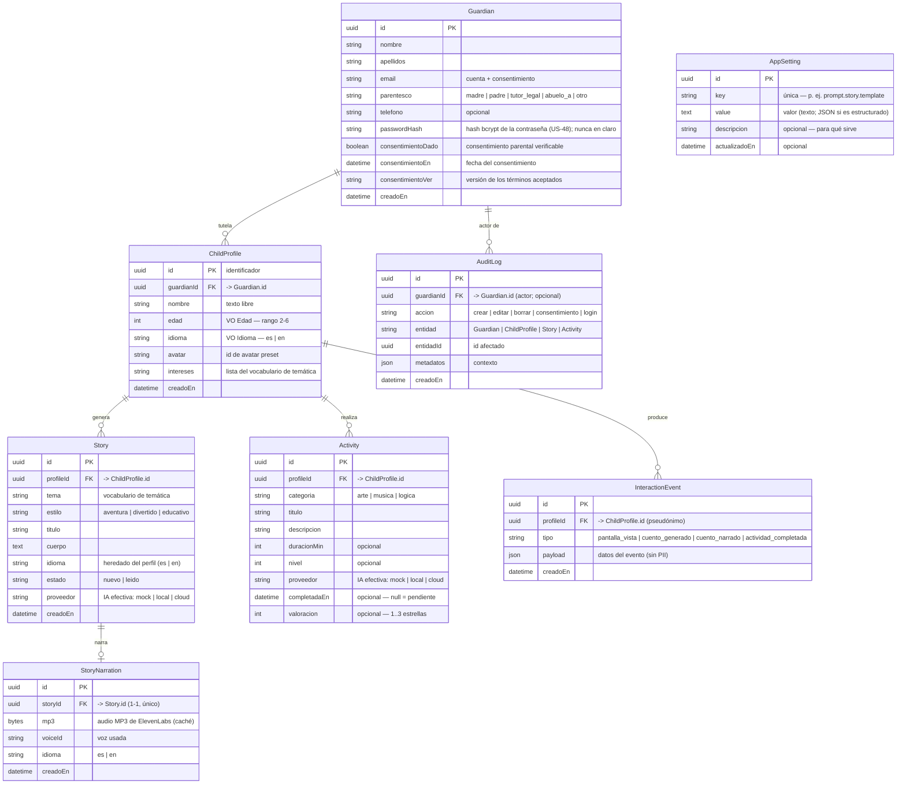

# Modelo de datos propuesto

Derivado del dominio (Fase 1) y de las decisiones I-1..I-7 de
[historias-usuario/](historias-usuario/README.md). Es el modelo **conceptual**; su
materialización relacional (Prisma + PostgreSQL) llega en la Fase 3.

Todo `ChildProfile` cuelga de un `Guardian` (adulto responsable), que es quien presta
el **consentimiento** — exigido porque los niños (2-6) son menores de 14/13. `AuditLog`
e `InteractionEvent` cubren trazabilidad y uso de **primera parte**. Ver
[cumplimiento-menores.md](cumplimiento-menores.md) para el marco legal y de tiendas.

## Diagrama entidad-relación

`StoryNarration` es la **caché de audio** de la narración de un cuento (US-22): relación 1-1 con
`Story` (`storyId` único), borrado en cascada. Guarda el MP3 generado por ElevenLabs para no
re-sintetizar (ni gastar créditos) en cada reproducción. El audio se genera bajo demanda
(`GET /stories/:id/narration`); si ElevenLabs falla, la app narra con la voz nativa del dispositivo
y no se persiste nada. **Aviso de privacidad:** narrar con ElevenLabs envía el `cuerpo` del cuento
(con el nombre del niño) a un tercero — desviación de C-2/C-5 asumida para el TFM, ver
[cumplimiento-menores.md](cumplimiento-menores.md).

`AppSetting` es **global** (no se relaciona con otras entidades): es una tabla
clave-valor para configuración de la app editable sin redeploy.

## AppSetting (configuración de la app)

Tabla clave-valor (`id`, `key`, `value`) para parámetros **ajustables en caliente**:
plantillas de prompt, identificadores de modelo y opciones de generación, sin tocar
código ni reconstruir la imagen.

**Claves previstas (seed inicial):**

| key                        | Ejemplo de value                                                                            | Uso                                                            |
| -------------------------- | ------------------------------------------------------------------------------------------- | -------------------------------------------------------------- |
| `ai.model.local`           | `gemma:2b`                                                                                  | Modelo Ollama por defecto                                      |
| `prompt.story.template`    | "Crea un cuento para {nombre} ({edad}) sobre {tema}…"                                       | Plantilla del cuento                                           |
| `prompt.activity.system`   | "Diseñas actividades educativas seguras…"                                                   | System prompt de `recommendActivities`                         |
| `prompt.activity.template` | "Propón {n} actividades para {edad} de {categoria}…"                                        | Plantilla de actividades                                       |
| `story.maxTokens`          | `800`                                                                                       | Límite de longitud del cuento                                  |
| `story.temperature`        | `0.7`                                                                                       | Creatividad del LLM                                            |
| `prompt.story.params`      | `{"palabrasMin":150,"palabrasMax":200,"rima":false,"formatos":["cuento","fabula","poema"]}` | Longitud/rima/formatos del cuento (uno al azar por generación) |
| `activity.count`           | `3`                                                                                         | Nº de actividades a generar                                    |
| `ai.cloud`                 | `{"activo":true,"target":"groq","model":"llama-3.3-70b-versatile"}`                         | Modo cloud (**ON por defecto**); key del target en env         |

**Reglas (importante):**

- **Secretos NO van aquí.** El bootstrap (`DATABASE_URL`, `PORT`, `AI_PROVIDER`) y las **API keys**
  del modo cloud (`GROQ_API_KEY`, `GEMINI_API_KEY`…) van en **variables de entorno** (`.env`), nunca
  en `AppSetting`. La clave `ai.cloud` guarda solo selectores no secretos (`activo`, `target`,
  `model`); la key del `target` se resuelve desde env.
- **Precedencia:** el entorno fija el arranque y los secretos; `AppSetting` ajusta los
  tunables en runtime. Si una clave falta en `AppSetting`, se usa un **valor por defecto
  en código** (así la Fase 2 funciona antes de existir la tabla, en Fase 3).
- **`value` es texto;** los valores estructurados se guardan como JSON y se parsean al leer.
- **Prompts seguros:** las plantillas deben imponer contenido **apto y seguro para
  niños** (guardarraíl), coherente con [cumplimiento-menores.md](cumplimiento-menores.md).

## Value-objects

Solo donde aportan (regla YAGNI del plan); el resto son escalares simples.

- **`Edad`** — entero en el rango **2 a 6** (ambos incluidos). Rechaza fuera de rango.
- **`Idioma`** — dominio cerrado **`{ es, en }`** (Español, Inglés). No hay más idiomas.
  Por defecto `es`. "Español (Latinoamérica)" es solo el rótulo de UI; el valor es `es`.

`avatar` (id de preset) e `intereses[]` son escalares/listas, **sin** value-object.

## Vocabularios cerrados (enums)

| Enum            | Valores                                            | Usado en                                 |
| --------------- | -------------------------------------------------- | ---------------------------------------- |
| **Temática**    | `animales · espacio · magia · aventuras · música`  | `ChildProfile.intereses[]`, `Story.tema` |
| **Estilo**      | `aventura · divertido · educativo`                 | `Story.estilo`                           |
| **Categoría**   | `arte · música · lógica`                           | `Activity.categoria`                     |
| **EstadoStory** | `nuevo · leido`                                    | `Story.estado`                           |
| **Idioma**      | `es · en`                                          | `ChildProfile.idioma`, `Story.idioma`    |
| **ProveedorIa** | `mock · local · cloud`                             | `Story.proveedor`, `Activity.proveedor`  |
| **Parentesco**  | `madre · padre · tutor_legal · abuelo_a · otro`    | `Guardian.parentesco`                    |
| **AccionAudit** | `crear · editar · borrar · consentimiento · login` | `AuditLog.accion`                        |

La **Temática es un único vocabulario compartido** por los intereses del perfil y el
tema del cuento; los intereses pre-seleccionan el tema (decisión I-2).

## Notas de persistencia (Fase 3)

- **Identificadores:** UUID.
- **`intereses[]`:** modelable como columna `text[]` de PostgreSQL o como tabla puente
  `ChildProfileInteres`. Para un catálogo cerrado y pequeño, `text[]` (o enum array)
  basta y evita un join (YAGNI); se decidirá al escribir el esquema Prisma.
- **Progreso sin entidad propia (decisión I-6):** el estado de lectura vive en
  `Story.estado`; la realización de una actividad vive en `Activity.completadaEn` +
  `Activity.valoracion`. `GetHistory` consulta ambas tablas por `profileId`.
- **Actividades generadas con IA (decisión I-3):** cada `Activity` es una instancia
  generada para un perfil y se persiste (no es un catálogo global). Para no repetir se usa un
  **dedup simple por título** sobre PostgreSQL; se descartó una base vectorial (Chroma)
  ([ADR 0004](ADR/0004-base-de-datos-vectorial-chroma.md), Rechazada).
- **Borrado de perfil (US-13):** `Story`, `Activity` e `InteractionEvent` se eliminan
  en cascada con su `ChildProfile`; borrar un `Guardian` elimina en cascada todos sus
  niños y datos asociados (derecho de supresión, GDPR).
- **`Guardian` y consentimiento:** el alta de un niño exige un `Guardian` con
  consentimiento registrado (`consentimientoDado/En/Ver`). Datos del adulto al mínimo
  necesario (minimización). El email es la base de la cuenta y del consentimiento.
- **`Guardian.passwordHash` (US-48):** la cuenta del adulto guarda el **hash bcrypt**
  de su contraseña; el login lo **verifica** (revierte la "identificación ligera sin
  contraseña" de Fase 5.5; ver C-1/C-10 en [cumplimiento-menores.md](cumplimiento-menores.md)).
  El hash es **dato del adulto, no del menor**, e irreversible: **nunca** se persiste ni se
  registra la contraseña en claro (ni en logs ni en `AuditLog`). bcrypt incorpora la sal en
  el propio valor, así que no hay columna de sal aparte.
- **`InteractionEvent` (primera parte):** sin PII en `payload`, referencia al niño por
  `profileId` interno (pseudónimo); **nunca** alimenta analítica/publicidad de terceros
  ni usa identificadores de dispositivo (regla de las tiendas Kids/Families).
- **`AuditLog`:** registra acciones sensibles del adulto (incl. el consentimiento) para
  trazabilidad y para poder acreditarlo.
- **Conservación:** definir política de retención/purga de `InteractionEvent` y
  `AuditLog` (limitación de conservación; ver C-9 en
  [cumplimiento-menores.md](cumplimiento-menores.md)).
