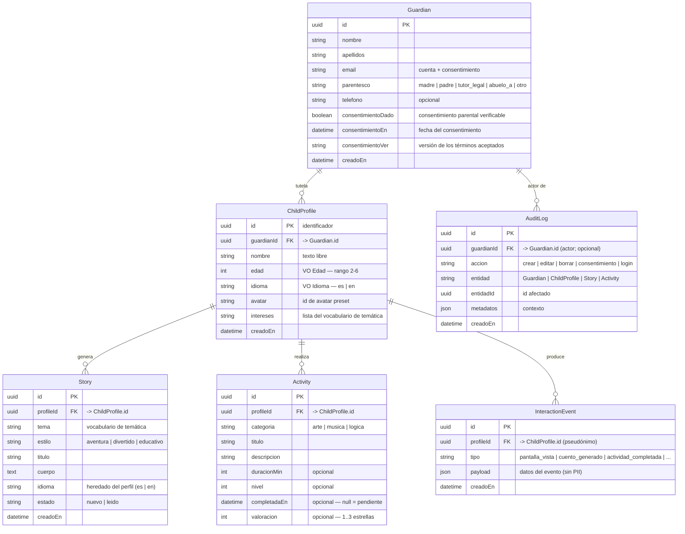

# Modelo de datos propuesto

Derivado del dominio (Fase 1) y de las decisiones I-1..I-7 de
[historias-usuario.md](historias-usuario.md). Es el modelo **conceptual**; su
materialización relacional (Prisma + PostgreSQL) llega en la Fase 3.

Todo `ChildProfile` cuelga de un `Guardian` (adulto responsable), que es quien presta
el **consentimiento** — exigido porque los niños (2-6) son menores de 14/13. `AuditLog`
e `InteractionEvent` cubren trazabilidad y uso de **primera parte**. Ver
[cumplimiento-menores.md](cumplimiento-menores.md) para el marco legal y de tiendas.

## Diagrama entidad-relación

## Value-objects

Solo donde aportan (regla YAGNI del plan); el resto son escalares simples.

- **`Edad`** — entero en el rango **2 a 6** (ambos incluidos). Rechaza fuera de rango.
- **`Idioma`** — dominio cerrado **`{ es, en }`** (Español, Inglés). No hay más idiomas.
  Por defecto `es`. "Español (Latinoamérica)" es solo el rótulo de UI; el valor es `es`.

`avatar` (id de preset) e `intereses[]` son escalares/listas, **sin** value-object.

## Vocabularios cerrados (enums)

| Enum            | Valores                                            | Usado en                                 |
| --------------- | -------------------------------------------------- | ---------------------------------------- |
| **Temática**    | `animales · espacio · magia · aventuras · música`  | `ChildProfile.intereses[]`, `Story.tema` |
| **Estilo**      | `aventura · divertido · educativo`                 | `Story.estilo`                           |
| **Categoría**   | `arte · música · lógica`                           | `Activity.categoria`                     |
| **EstadoStory** | `nuevo · leido`                                    | `Story.estado`                           |
| **Idioma**      | `es · en`                                          | `ChildProfile.idioma`, `Story.idioma`    |
| **Parentesco**  | `madre · padre · tutor_legal · abuelo_a · otro`    | `Guardian.parentesco`                    |
| **AccionAudit** | `crear · editar · borrar · consentimiento · login` | `AuditLog.accion`                        |

La **Temática es un único vocabulario compartido** por los intereses del perfil y el
tema del cuento; los intereses pre-seleccionan el tema (decisión I-2).

## Notas de persistencia (Fase 3)

- **Identificadores:** UUID.
- **`intereses[]`:** modelable como columna `text[]` de PostgreSQL o como tabla puente
  `ChildProfileInteres`. Para un catálogo cerrado y pequeño, `text[]` (o enum array)
  basta y evita un join (YAGNI); se decidirá al escribir el esquema Prisma.
- **Progreso sin entidad propia (decisión I-6):** el estado de lectura vive en
  `Story.estado`; la realización de una actividad vive en `Activity.completadaEn` +
  `Activity.valoracion`. `GetHistory` consulta ambas tablas por `profileId`.
- **Actividades generadas con IA (decisión I-3):** cada `Activity` es una instancia
  generada para un perfil y se persiste (no es un catálogo global). Chroma se evaluará
  como memoria semántica para deduplicar/relacionar lo generado
  ([ADR 0004](ADR/0004-base-de-datos-vectorial-chroma.md)).
- **Borrado de perfil (US-13):** `Story`, `Activity` e `InteractionEvent` se eliminan
  en cascada con su `ChildProfile`; borrar un `Guardian` elimina en cascada todos sus
  niños y datos asociados (derecho de supresión, GDPR).
- **`Guardian` y consentimiento:** el alta de un niño exige un `Guardian` con
  consentimiento registrado (`consentimientoDado/En/Ver`). Datos del adulto al mínimo
  necesario (minimización). El email es la base de la cuenta y del consentimiento.
- **`InteractionEvent` (primera parte):** sin PII en `payload`, referencia al niño por
  `profileId` interno (pseudónimo); **nunca** alimenta analítica/publicidad de terceros
  ni usa identificadores de dispositivo (regla de las tiendas Kids/Families).
- **`AuditLog`:** registra acciones sensibles del adulto (incl. el consentimiento) para
  trazabilidad y para poder acreditarlo.
- **Conservación:** definir política de retención/purga de `InteractionEvent` y
  `AuditLog` (limitación de conservación; ver C-9 en
  [cumplimiento-menores.md](cumplimiento-menores.md)).
