# Modelo de datos propuesto

Derivado del dominio (Fase 1) y de las decisiones I-1..I-7 de
[historias-usuario.md](historias-usuario.md). Es el modelo **conceptual**; su
materialización relacional (Prisma + PostgreSQL) llega en la Fase 3.

## Diagrama entidad-relación

```mermaid
erDiagram
    ChildProfile ||--o{ Story : "genera"
    ChildProfile ||--o{ Activity : "realiza"

    ChildProfile {
        uuid     id            PK "identificador"
        string   nombre        "texto libre"
        int      edad          "VO Edad — rango 2-6"
        string   idioma        "VO Idioma — es | en"
        string   avatar        "id de avatar preset"
        string   intereses     "lista del vocabulario de temática"
        datetime creadoEn
    }

    Story {
        uuid     id        PK
        uuid     profileId FK "-> ChildProfile.id"
        string   tema      "vocabulario de temática"
        string   estilo    "aventura | divertido | educativo"
        string   titulo
        text     cuerpo
        string   idioma    "heredado del perfil (es | en)"
        string   estado    "nuevo | leido"
        datetime creadoEn
    }

    Activity {
        uuid     id          PK
        uuid     profileId   FK "-> ChildProfile.id"
        string   categoria   "arte | musica | logica"
        string   titulo
        string   descripcion
        int      duracionMin "opcional"
        int      nivel       "opcional"
        datetime completadaEn "opcional — null = pendiente"
        int      valoracion  "opcional — 1..3 estrellas"
    }
```

## Value-objects

Solo donde aportan (regla YAGNI del plan); el resto son escalares simples.

- **`Edad`** — entero en el rango **2 a 6** (ambos incluidos). Rechaza fuera de rango.
- **`Idioma`** — dominio cerrado **`{ es, en }`** (Español, Inglés). No hay más idiomas.
  Por defecto `es`. "Español (Latinoamérica)" es solo el rótulo de UI; el valor es `es`.

`avatar` (id de preset) e `intereses[]` son escalares/listas, **sin** value-object.

## Vocabularios cerrados (enums)

| Enum            | Valores                                           | Usado en                                 |
| --------------- | ------------------------------------------------- | ---------------------------------------- |
| **Temática**    | `animales · espacio · magia · aventuras · música` | `ChildProfile.intereses[]`, `Story.tema` |
| **Estilo**      | `aventura · divertido · educativo`                | `Story.estilo`                           |
| **Categoría**   | `arte · música · lógica`                          | `Activity.categoria`                     |
| **EstadoStory** | `nuevo · leido`                                   | `Story.estado`                           |
| **Idioma**      | `es · en`                                         | `ChildProfile.idioma`, `Story.idioma`    |

La **Temática es un único vocabulario compartido** por los intereses del perfil y el
tema del cuento; los intereses pre-seleccionan el tema (decisión I-2).

## Notas de persistencia (Fase 3)

- **Identificadores:** UUID.
- **`intereses[]`:** modelable como columna `text[]` de PostgreSQL o como tabla puente
  `ChildProfileInteres`. Para un catálogo cerrado y pequeño, `text[]` (o enum array)
  basta y evita un join (YAGNI); se decidirá al escribir el esquema Prisma.
- **Progreso sin entidad propia (decisión I-6):** el estado de lectura vive en
  `Story.estado`; la realización de una actividad vive en `Activity.completadaEn` +
  `Activity.valoracion`. `GetHistory` consulta ambas tablas por `profileId`.
- **Actividades generadas con IA (decisión I-3):** cada `Activity` es una instancia
  generada para un perfil y se persiste (no es un catálogo global). Chroma se evaluará
  como memoria semántica para deduplicar/relacionar lo generado
  ([ADR 0004](ADR/0004-base-de-datos-vectorial-chroma.md)).
- **Borrado de perfil (US-13):** `Story` y `Activity` se eliminan en cascada con su
  `ChildProfile`.
