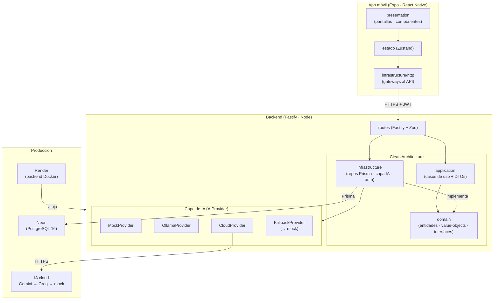

# Aprendizaje Mágico

App infantil **bilingüe (ES/EN)** que crea perfiles de niño y genera **cuentos** y
**actividades** personalizados con IA, bajo una **arquitectura limpia** en monorepo (backend
Node + app móvil React Native). La IA tiene modos intercambiables (`mock` · `local` con Ollama ·
`cloud` compatible con GEMINI y GROQ) con _fallback_ automático, de modo que todo el flujo funciona
en local **sin GPU ni claves**.

> Proyecto de TFM (Máster IA). El alcance por fases vive en
> [Docs/plan-ejecucion-master.md](Docs/plan-ejecucion-master.md) y la guía para agentes en
> [CLAUDE.md](CLAUDE.md). Licencia [PolyForm Noncommercial 1.0.0](LICENSE).

## TFM: vídeo y presentación

- 🎬 **Vídeo de demostración:** <https://canva.link/zhrj9ajsty1i7ds>
- 📊 **Presentación:** <https://canva.link/wtpxox4rg45kjkc>

## Descargar la app (Android)

**APK lista para instalar (v1.16.0):**

- **Descarga directa (recomendada, enlace permanente):**
  [`aprendizajemagico_v_1.16.0.1.apk`](https://github.com/Mithor86-2/magyblobapp/releases/download/v1.16.0/aprendizajemagico_v_1.16.0.1.apk)
  (asset de la [Release v1.16.0](https://github.com/Mithor86-2/magyblobapp/releases/tag/v1.16.0)).
- **Alternativa:** [build en Expo EAS](https://expo.dev/accounts/mithor1986/projects/magyblob-app/builds/85ddeabf-1f84-4ec4-ba1e-faae7e3aad9f)
  → en esa página, **Install** (QR o descarga del `.apk`). _El enlace de EAS puede caducar; la Release
  es el respaldo permanente._

En el móvil: abre el `.apk` y permite «instalar apps de orígenes desconocidos» (o por cable,
`adb install <fichero>.apk`). La app apunta al **backend de producción**; la primera petición tras
inactividad tarda ~50 s (_cold start_ del plan gratuito de Render).

### Acceso de prueba (evaluador)

La app tiene login, así que hay una **cuenta de prueba** sembrada en producción con un perfil de
niño listo para usar (no hace falta registrarse):

| Campo          | Valor                                              |
| -------------- | -------------------------------------------------- |
| **Email**      | `usuariotest@mail.com`                             |
| **Contraseña** | `S12345678s`                                       |
| Perfil de niño | «Fulanito», 3 años, intereses _animales_ y _magia_ |

Inicia sesión con esas credenciales para generar cuentos y actividades, escuchar la narración y ver
el historial. _(Backend de producción: `https://magyblobapp.onrender.com`; recuerda el ~50 s de cold
start en la primera petición.)_ La cuenta se siembra de forma idempotente con
`pnpm --filter @magyblob/backend seed:test-user` (ver US-105).

## Funcionalidades

- **Onboarding y sesión** — alta del adulto con consentimiento, login por email y **sesión JWT**;
  **multi-perfil** de niños bajo un mismo adulto.
- **Cuentos con IA** — generación por perfil (tema + estilo) en el idioma del niño, con **portada**
  ilustrada y **narración (TTS)**, ambas con respaldo local.
- **Actividades con IA** — recomendaciones por edad/intereses con instrucciones paso a paso y
  marcado de "Realizado" con valoración.
- **Historial y favoritos** — cuentos y actividades con búsqueda de texto, filtros y relectura.
- **Modo anónimo** — probar sin cuenta (rate-limited por IP).
- **Privacidad y menores** — gate parental, minimización de datos y modos de IA que por defecto no
  sacan datos ([Docs/cumplimiento-menores.md](Docs/cumplimiento-menores.md)).

## Stack técnico

| Capa           | Tecnologías                                                                                               |
| -------------- | --------------------------------------------------------------------------------------------------------- |
| **Backend**    | Node ≥ 24 · Fastify · Prisma · PostgreSQL 16 · pino · Vitest                                              |
| **App móvil**  | Expo (React Native) · React Navigation · Zustand · Playwright (E2E web)                                   |
| **IA**         | `AIProvider` conmutable: mock · Ollama (`gemma:2b`) · cloud (cascada Gemini→Groq→mock, OpenAI-compatible) |
| **Monorepo**   | pnpm workspaces · Docker Compose · ESLint + Prettier · Husky                                              |
| **Producción** | Render (backend Docker) · Neon (PostgreSQL) · IA cloud Gemini→Groq · Expo EAS (APK)                       |

## Requisitos

- Node.js ≥ 24 y pnpm (vía `corepack enable`)
- Docker + Docker Compose

## Arranque rápido (Docker)

Sin nada externo: levanta backend + PostgreSQL + Ollama en modo `mock` (sin GPU, sin claves).

```bash
cp .env.example .env          # ajusta valores si hace falta
docker compose up --build     # backend + PostgreSQL 16 + Ollama
```

El backend **aplica las migraciones al arrancar** (`prisma migrate deploy`) y queda en
<http://localhost:3000> (healthcheck en `/health`):

```bash
curl http://localhost:3000/health   # -> {"status":"ok","service":"magyblob-backend"}
```

Atajos equivalentes: `pnpm up:mock` (pila en modo mock) · `pnpm up:local` (descarga `gemma:2b` y
usa IA local real) · `pnpm down` (para la pila; los datos persisten).

## Modos de IA

El proveedor de IA es conmutable y siempre cae a un modo seguro si algo falla:

- **`mock`** — por defecto en local; sin GPU ni modelo. Es también el _fallback_ automático.
- **`local`** — Ollama + `gemma:2b`. Descarga el modelo con `pnpm ollama:setup` y pon
  `AI_PROVIDER=local`.
- **`cloud`** — proveedores compatibles con OpenAI en **cascada `Gemini → Groq → mock`** (US-99):
  el primario es **Gemini** (`gemini-2.5-flash`); si falla o no tiene key, **Groq**
  (`llama-3.3-70b`); si tampoco, **mock**. Cada paso sin su API key en env se **omite** y la cadena
  **termina siempre en mock**. Conmutable en caliente desde la BD (`ai.cloud`); las keys van en env.

> ⚠️ El modo cloud saca datos **minimizados** del perfil a un tercero (edad, intereses, idioma;
> nunca nombre) — desviación de privacidad asumida en el TFM. Ver
> [Docs/cumplimiento-menores.md](Docs/cumplimiento-menores.md) (C-5) y
> [ADR 0002](Docs/ADR/0002-tres-modos-de-ia.md). Configuración detallada (targets, `psql`, seed) en
> [Docs/configuracion-app-settings.md](Docs/configuracion-app-settings.md).

## App móvil (desarrollo)

La app `@magyblob/app` ("Aprendizaje Mágico") usa **dev build** (no Expo Go, por módulos nativos):

```bash
pnpm up:local                                    # backend en http://localhost:3000
cp packages/app/.env.example packages/app/.env   # fija EXPO_PUBLIC_API_URL según el destino
cd packages/app && npx expo run:android          # o run:ios (macOS + Xcode)
```

> `EXPO_PUBLIC_API_URL` se incrusta en build-time: emulador Android → `http://10.0.2.2:3000`,
> simulador iOS → `http://localhost:3000`, móvil físico → `http://<IP-LAN>:3000`. Si cambias el
> `.env`, **relanza** `expo run:*` (no basta recargar). Detalle en `README.local.md` (runbook local,
> no versionado) y en [Docs/despliegue.md](Docs/despliegue.md).

## Arquitectura

**Clean Architecture** en un monorepo pnpm: las dependencias apuntan **hacia dentro** (`domain` no
depende de nada; la aplicación depende solo de interfaces de `domain`; la infraestructura implementa
esas interfaces). El corazón es la **capa de IA**: una interfaz `AIProvider` con proveedores
intercambiables (`mock`/`local`/`cloud`) y _fallback_ automático a `mock` ante cualquier fallo. La
frontera de capas está reforzada por ESLint (ver [ADR 0001](Docs/ADR/0001-arquitectura-limpia-monorepo.md) y
[ADR 0002](Docs/ADR/0002-tres-modos-de-ia.md)).



## Estructura del monorepo

```text
magyblobApp/
├─ packages/
│  ├─ backend/                 API Fastify + Prisma + capa de IA (Clean Architecture)
│  │  ├─ src/
│  │  │  ├─ domain/            Entidades, value-objects e interfaces (sin frameworks ni IO)
│  │  │  │  ├─ entities/       Guardian · ChildProfile · Story · Activity · Achievement…
│  │  │  │  ├─ value-objects/  Edad (2–6) · Idioma (es/en)
│  │  │  │  ├─ repositories/   Interfaces de persistencia (puertos)
│  │  │  │  ├─ ai/             Interfaz AIProvider (puerto)
│  │  │  │  └─ events/         EventBus + eventos de dominio (Observer)
│  │  │  ├─ application/       Casos de uso + DTOs (dependen solo de domain)
│  │  │  ├─ infrastructure/    Adaptadores: repos Prisma · IA · auth · email · eventos
│  │  │  │  └─ ai/             MockProvider · OllamaProvider · CloudProvider · Fallback
│  │  │  └─ routes/            Rutas Fastify (validación Zod) + composition root
│  │  ├─ prisma/               schema.prisma · migraciones · seeds (AppSetting + usuario prueba)
│  │  └─ test/                 Integración de rutas · integración Prisma · E2E backend
│  └─ app/                     App móvil Expo (Clean Architecture ligera)
│     └─ src/
│        ├─ domain/            Tipos y contratos de gateway
│        ├─ infrastructure/    Cliente HTTP · esquemas Zod · Sentry · telemetría
│        ├─ presentation/      Pantallas · componentes · navegación · theme
│        └─ store/             Estado global (Zustand, persistido)
├─ Docs/                       Documentación viva (plan, fases, decisiones, API, despliegue…)
├─ docker-compose.yml          Pila local: backend + PostgreSQL 16 + Ollama
└─ render.yaml                 Infra como código del despliegue en Render
```

## Comandos

| Comando                             | Qué hace                                                |
| ----------------------------------- | ------------------------------------------------------- |
| `pnpm check`                        | typecheck + lint + formato + tests (todo el monorepo)   |
| `pnpm typecheck`                    | `tsc --noEmit` en cada paquete                          |
| `pnpm lint` / `pnpm lint:fix`       | ESLint (+ SonarJS en el backend)                        |
| `pnpm format` / `pnpm format:check` | Prettier                                                |
| `pnpm test`                         | Vitest (unitarios + integración de rutas)               |
| `pnpm coverage`                     | Cobertura por tier (Strategic Coverage 100/80/0, US-35) |

## Pruebas

Tres niveles (unitario · integración · E2E). El gate diario (`pnpm check`) no necesita Docker; la
integración de persistencia y los E2E sí (Testcontainers + Playwright) y siempre corren en CI. Los
git hooks (Husky) ejecutan `lint-staged` en `pre-commit` y `pnpm check` en `pre-push`.

Detalle —qué cubre cada nivel, cómo ejecutarlos, TDD y Strategic Coverage— en
[Docs/estrategia-pruebas.md](Docs/estrategia-pruebas.md).

## API

Las rutas de datos exigen un **access token JWT**; el alta y el login lo emiten. Endpoints,
parámetros, esquemas y ejemplos `curl` (incluido el flujo alta → perfil → cuento) en
[Docs/api.md](Docs/api.md).

## Despliegue

Backend como web service Docker en **Render** (`main`), PostgreSQL gestionado en **Neon** e IA
cloud en **cascada Gemini→Groq→mock** (todo en plan free); infra como código en [`render.yaml`](render.yaml). La app se
publica con **Expo EAS** (perfil `preview`, APK) o como export web estático. Guía reproducible paso
a paso (variables, secretos, validación en prod) en [Docs/despliegue.md](Docs/despliegue.md).

## Documentación

| Documento                                                      | Qué contiene                                      |
| -------------------------------------------------------------- | ------------------------------------------------- |
| [Docs/plan-ejecucion-master.md](Docs/plan-ejecucion-master.md) | Arquitectura, orden de fases y Definition of Done |
| [Docs/phases.md](Docs/phases.md)                               | Estado por fase (hecho / pendiente)               |
| [Docs/api.md](Docs/api.md)                                     | Referencia de la API HTTP                         |
| [Docs/despliegue.md](Docs/despliegue.md)                       | Guía de despliegue de producción                  |
| [Docs/estrategia-pruebas.md](Docs/estrategia-pruebas.md)       | Niveles de prueba, TDD y cobertura                |
| [Docs/modelo-datos.md](Docs/modelo-datos.md)                   | Modelo de datos (ER + entidades)                  |
| [Docs/cumplimiento-menores.md](Docs/cumplimiento-menores.md)   | Requisitos de app infantil / privacidad           |
| [Docs/historias-usuario/](Docs/historias-usuario/README.md)    | Historias de usuario y trazabilidad               |
| [Docs/ADR/](Docs/ADR)                                          | Decisiones de arquitectura                        |

## Licencia

[PolyForm Noncommercial 1.0.0](LICENSE) — uso no comercial.
